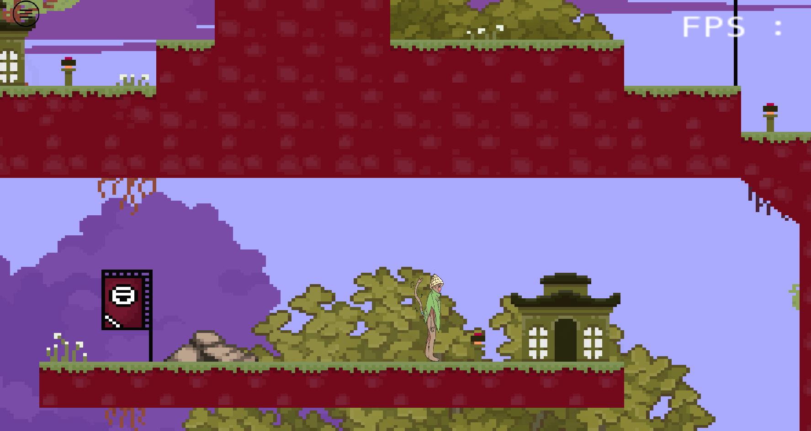

# Hi, I'm Fares Raouazi 

### Gameplay Programmer | Game Development Student

I'm a second-year Game Development student at **Gaming Campus Lyon**, passionate about video games and gameplay programming.

I mainly work with **C++** and custom game engines, and I'm particularly interested in creating gameplay systems and interactive mechanics.

I'm currently looking to improve my programming skills and gain more experience by working on game projects.

---

## Skills & Tools

### Programming
- **C++**
- **Python**

### Game Development
- Custom Game Engines
- Gameplay Programming
- Character Systems
- Gamepad Integration
- UI Programming

### Tools
- **Visual Studio**
- **Git / GitHub**
- **Adobe Premiere Pro**
- **Adobe Photoshop**

---

# Featured Project

## Reverbs

> **Puzzle Platformer — C++ — Custom Engine**

**Mini Studio** is a puzzle platformer developed as part of a school project at Gaming Campus.

The objective is to collect different **totems** in order to unlock the exit portal.  
Players must use the unique mechanics of different characters to solve puzzles and progress through the game.

The project was developed by a team of **13 students** over approximately **3 weeks**.

### Project Details

| | |
|---|---|
| **Genre** | Puzzle Platformer |
| **Team Size** | 13 developers |
| **Development Time** | ~3 weeks |
| **Language** | C++ |
| **Engine** | Custom Engine |
| **Platform** | Windows |
| **Controls** | Gamepad |
| **Context** | School Project |

---

### My Contributions

I worked as a **Gameplay Programmer** on the project.

My main responsibilities included:

- Implementing the **character switching system**
- Developing the gameplay of the **Monkey and Fox characters**
- Implementing **character movement**
- Creating the **melody-based character switching mechanic**
- Implementing **gamepad configuration**
- Working on the game's **UI**
- Debugging and fixing gameplay issues

The custom engine used for the project was developed by other programmers within the team.

---

### What I Learned

Working on this project taught me how to organize my work both independently and within a large development team.

Developing a complete playable game in only a few weeks also taught me how to:

- Prioritize features
- Work under strict deadlines
- Communicate with other developers
- Debug and iterate quickly
- Integrate my work into a larger codebase
- Deliver a finished and playable project

---

### Screenshots

<!-- Add screenshots here -->

  
  

---

### Gameplay

<!-- Add your gameplay video or GIF here -->

[Watch the gameplay video](https://drive.google.com/file/d/1LmHO8p-pqVv-TEcx2L9kexWybRiJxO8_/view?usp=drive_link)

---

## Education

**Gaming Campus — Lyon, France**

Game Development  
**Second Year**

---

## Currently

I'm continuing to develop my skills in **C++ and gameplay programming**, while working on personal and school projects to gain more experience in game development.

I'm particularly interested in:

- Gameplay Programming
- Game Mechanics
- Character Systems
- C++ Game Development
- Game Engine Programming

---

## Contact

*Contact information will be added later.*
